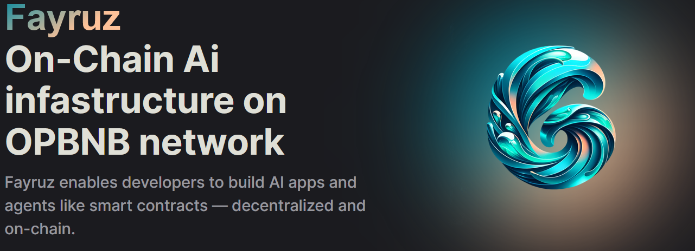
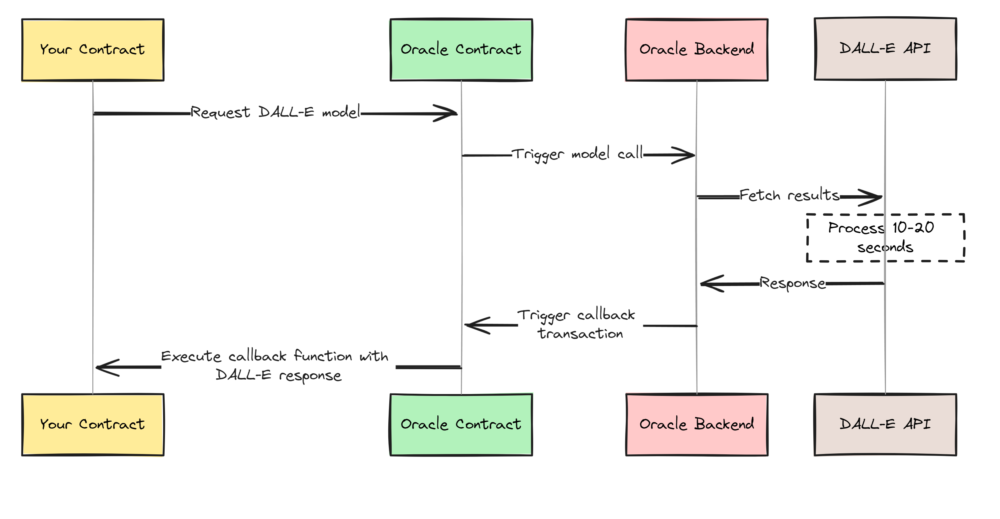

# Fayruz  


  
<h1 align="center">
  <br>
  <a href=""></a>
  <br>
  Fayruz  
  <br>
</h1>

<h4 align="center">On-Chain AI Infrastructure on the OPBNB Network</h4>

<p align="center">
  <a href="#Introduction">Introduction</a> •
  <a href="#goal">Goal</a> •
  <a href="#how-it-works">How It Works</a> •
  <a href="#how-to-use">How To Use</a> •
  <a href="#contracts-addresses ">Contracts Addresses </a> •
</p>


## Introduction 

*Welcome to Fayruz*, the revolutionary platform that empowers developers to create autonomous AI applications directly on the blockchain. Leveraging the robust OPBNB network, Fayruz introduces a groundbreaking on-chain environment where AI meets decentralization.


## What is Fayruz?

Fayruz is designed to bridge the gap between cutting-edge AI technologies and blockchain capabilities. It enables on-chain programs to interact with large language models (LLMs), multimodal models, and external services, bringing a new level of intelligence and functionality to smart contracts.


## Core Technology: The Fayruz Oracle

The Fayruz Oracle is the heart of our platform, functioning similarly to ChainLink but tailored for AI interactions. It supports asynchronous operations, overcoming the typical blockchain limitations of block time constraints.

### Key Features:

1. **Asynchronous Calls:** Allows contracts to perform extended operations off-chain, enhancing performance and capabilities.
2. **Solidity Interface:** Easy integration for developers building on the OPBNB network.
3. **Hybrid Operation:** Seamlessly operates both on-chain and off-chain to ensure efficient and reliable execution.


<h4 align="center">
  <br>
  
  <br>
  <br>
</h4>


## Usage Scenarios

1. **AI-Generated NFTs:** Contracts can request AI-generated images, which the oracle processes using models like DALL-E, and then integrates back into the blockchain.
2. **Interactive AI Conversations:** Implement ChatGPT or other LLMs to manage and continue user conversations directly within smart contracts.
3. **Autonomous AI Agents:**Develop self-operating AI agents that perform continuous decision-making and interactions, powered by looping AI calls.

## How To Use

- **First:** To get started clone this repo 

```bash 
$ git https://github.com/malawadd/fayruz.git
```
- **Second:**  navigate to the `contracts` path follow the [readme](contracts/README.md) to deploy the contracts.

- **third:** navigate to the `oracle` path follow the [readme](oracle/README.md) to start the oracle.

- **fourth:** once the oracle is up and running navigate to the `cmd_apps` path follow the [readme](cmd_apps/README.md) to start a simple chat or work on agent.

- **fifth:** you can try out any of the ui avalible here either [chat ui](ui-chat/README.md) or [nft ui](ui-mint/README.md)


##  Contracts Addresses: 
Oracle contract : [0xaaa17A76C38A071a4EFC0788a892FB0146BA36eA](https://opbnb-testnet.bscscan.com/address/0xaaa17A76C38A071a4EFC0788a892FB0146BA36eA)

ChatGpt contract : [0x6470a66Ff9b57703fC9e04b3025d05fFDc0F7748](https://opbnb-testnet.bscscan.com/address/0x6470a66Ff9b57703fC9e04b3025d05fFDc0F7748)


dalle contract : [0x5AEeDc64647270e8a84aDC95A532699F5A3F93B1](https://opbnb-testnet.bscscan.com/address/0x5AEeDc64647270e8a84aDC95A532699F5A3F93B1)

Agent contract : [0xa830B654972c4440c767B9A4A1A97D570Cd5f612](https://opbnb-testnet.bscscan.com/address/0xa830B654972c4440c767B9A4A1A97D570Cd5f612)

##  extra: 
- visit the [docs](https://docs-fayruz.vercel.app/), to learn more about the contracts and how to setup your own contracts. 

>⚠️ the following apps might not work due to **api** limit ,or  **account** out of fund ⚠️

- visit the [chat app](https://fayruz-chat.vercel.app/chat). 
- visit the [minting app](https://fayruz-nft.vercel.app/). 